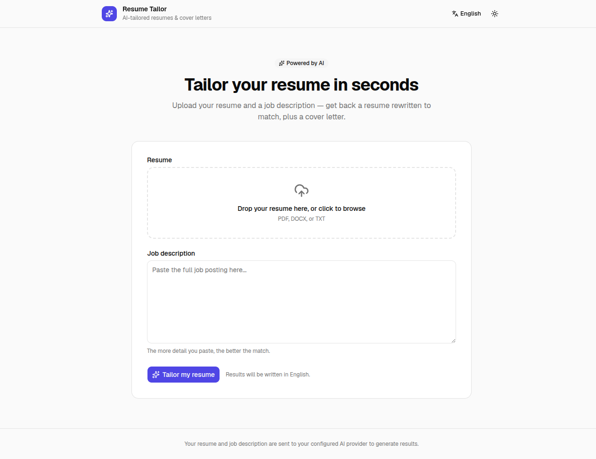
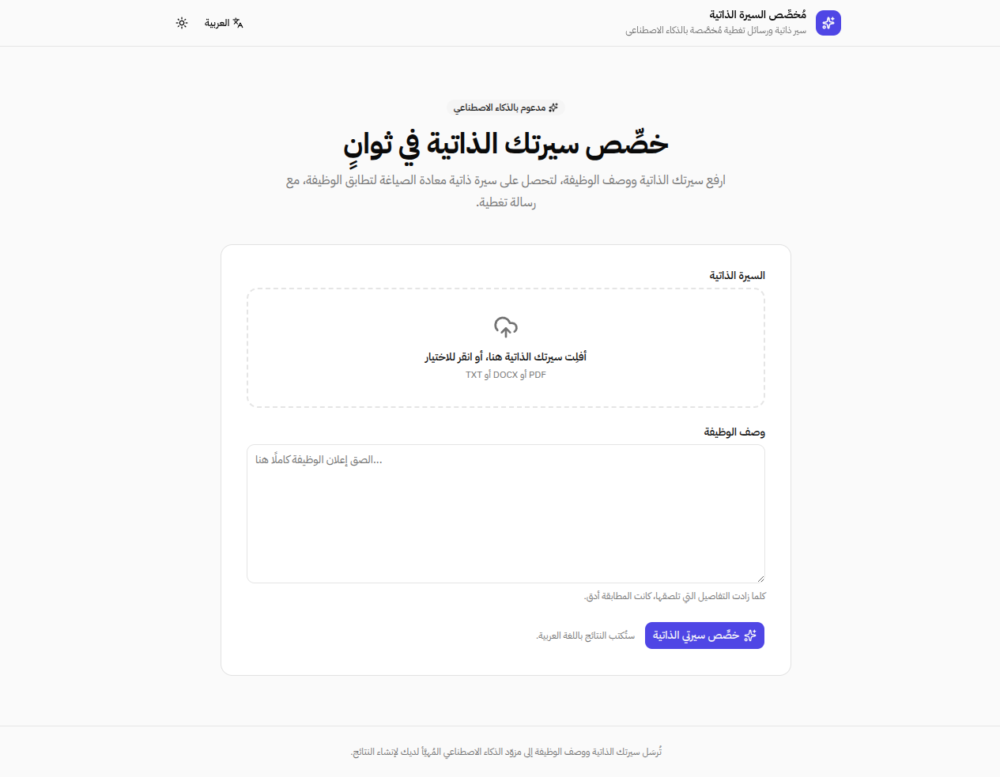
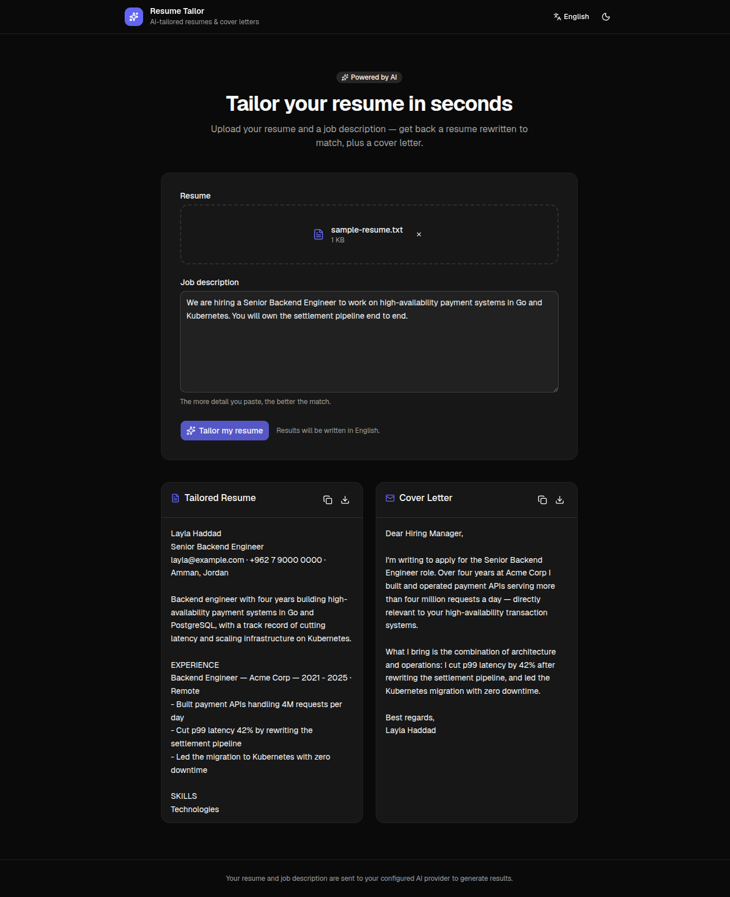
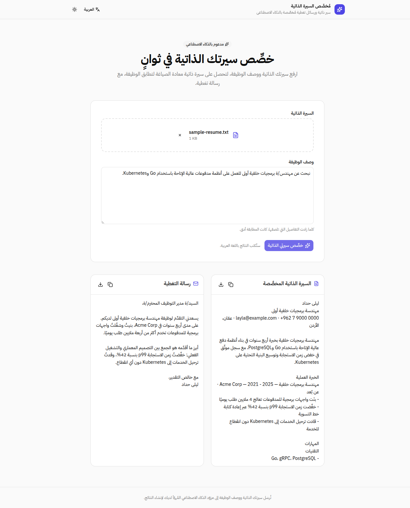
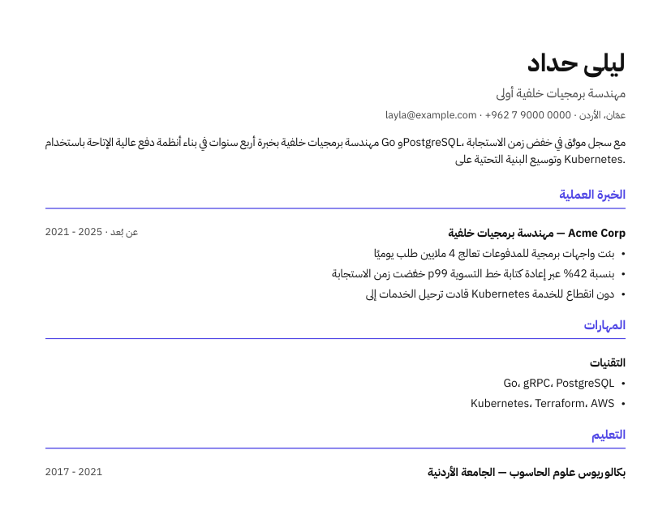

# Resume Tailor

Upload a master resume (PDF/DOCX/TXT), paste a job description, and get back an AI-tailored resume (downloadable as PDF) plus a matching cover letter. Available in **English and Arabic**, with full RTL support.

## Screenshots

| English (LTR) | العربية (RTL) |
|---|---|
|  |  |

Results — the model writes its output in the selected UI language:

| Tailored output (dark) | النتائج بالعربية |
|---|---|
|  |  |

The generated PDF is RTL-aware and embeds an Arabic face, so Arabic résumés keep correct letter joining and bidi ordering:



## Setup

```bash
npm install
cp .env.local.example .env.local
# add your ANTHROPIC_API_KEY to .env.local
npm run dev
```

Open [http://localhost:3000](http://localhost:3000) — you'll be redirected to `/en` or `/ar` based on your browser's `Accept-Language`.

## How it works

- `app/[lang]/layout.tsx` — root layout; sets `lang`/`dir`, picks the font stack, wraps the app in shadcn's `DirectionProvider`
- `app/[lang]/page.tsx` — loads the dictionary for the locale and hands it to the form
- `components/tailor-form.tsx` — upload form + results UI, built from shadcn/ui components
- `app/api/tailor/route.ts` — handles the upload, extracts resume text, calls the LLM
- `lib/parseResume.ts` — PDF (`pdf-parse`) / DOCX (`mammoth`) text extraction
- `lib/llm.ts` — provider abstraction; set `LLM_PROVIDER` to `anthropic` (default), `openai`, or `gemini` in `.env.local`
- `lib/prompts.ts` — the tailoring prompt + structured output schema (name, headline, contact, summary, sections)
- `lib/resumeText.ts` — flattens the structured resume into plain text for the on-screen preview / copy button
- `lib/ResumeDocument.tsx` — renders the structured resume as a PDF via `@react-pdf/renderer`

## UI

The interface is built with [shadcn/ui](https://ui.shadcn.com) (Radix base, `nova` preset, RTL enabled in `components.json`). Components live in `components/ui/` and are yours to edit; design tokens are CSS variables in `app/globals.css`.

Add more components with:

```bash
npx shadcn@latest add <component>
```

Light/dark/system theming is class-based — an inline `beforeInteractive` script (`lib/theme.ts`) applies the stored preference before first paint, so there is no flash.

## Internationalization

| Piece | Where |
|---|---|
| Supported locales, direction, cookie name | `i18n/config.ts` |
| UI strings | `i18n/dictionaries/en.json`, `i18n/dictionaries/ar.json` |
| Locale detection + redirect | `proxy.ts` (Next 16's replacement for `middleware.ts`) |

Every route is prefixed with a locale (`/en/...`, `/ar/...`). A bare URL is redirected using the `NEXT_LOCALE` cookie if one is set, otherwise the browser's `Accept-Language`. The language switcher in the header writes that cookie.

The selected locale is also sent with the tailoring request, so the model writes the resume and cover letter in that language — including section headings and the cover letter body. For Arabic it's told to keep proper nouns, technology names, and acronyms in Latin script and to use Western Arabic numerals.

Layout is direction-agnostic: components use CSS logical properties (`ms-`/`me-`, `ps-`/`pe-`, `text-start`) rather than left/right, and user content (uploaded file names, the job description, generated results) is rendered with `dir="auto"` so an Arabic résumé reads correctly even with the English UI.

### Adding a language

1. Add the code to `locales` in `i18n/config.ts`, plus its entry in `localeDirections`, `localeNames`, and `localeOutputLanguage`.
2. Copy `i18n/dictionaries/en.json` to `i18n/dictionaries/<code>.json` and translate it.
3. Register it in `i18n/dictionaries.ts`.

If the new language needs a different script, add a font for it in `app/[lang]/layout.tsx` and a `--app-font-sans` override in `app/globals.css`.

## Provider config

| Env var | Default | Notes |
|---|---|---|
| `LLM_PROVIDER` | `anthropic` | `anthropic`, `openai`, or `gemini` |
| `ANTHROPIC_API_KEY` | — | required for the anthropic provider |
| `OPENAI_API_KEY` | — | required for the openai provider |
| `OPENAI_MODEL` | `gpt-4o` | only used with the openai provider |
| `GEMINI_API_KEY` | — | required for the gemini provider; free key at [aistudio.google.com/apikey](https://aistudio.google.com/apikey) |
| `GEMINI_MODEL` | `gemini-flash-latest` | only used with the gemini provider |
